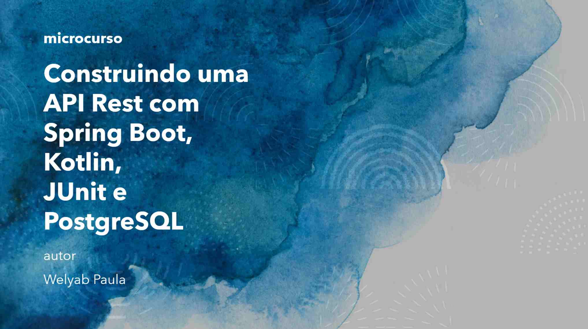

# Palestra sobre construção de API Rest usando Spring Boot e linguagem Kotlin

---

Este é o código fonte de uma apresentação onde falei sobre alguns conceitos relacionados à construção de API web
na linguagem Kotlin usando o framework Spring Boot

* Link do artigo no meu blog: [Apresentei uma palestra sobre API Rest com Kotlin e Spring Boot](https://welyab.dev/2024/03/06/apresentei-uma-palestra-sobre-api-rest-com-kotlin-e-spring-boot/)
* Gravações no YouTube: [dia 1](https://www.youtube.com/watch?v=1RlwPNxrquo), [dia 2](https://www.youtube.com/watch?v=UjxDpN-wtew)
* Slides da apresentação: [microcurso - api rest.pdf](./microcurso%20-%20api%20rest.pdf)

